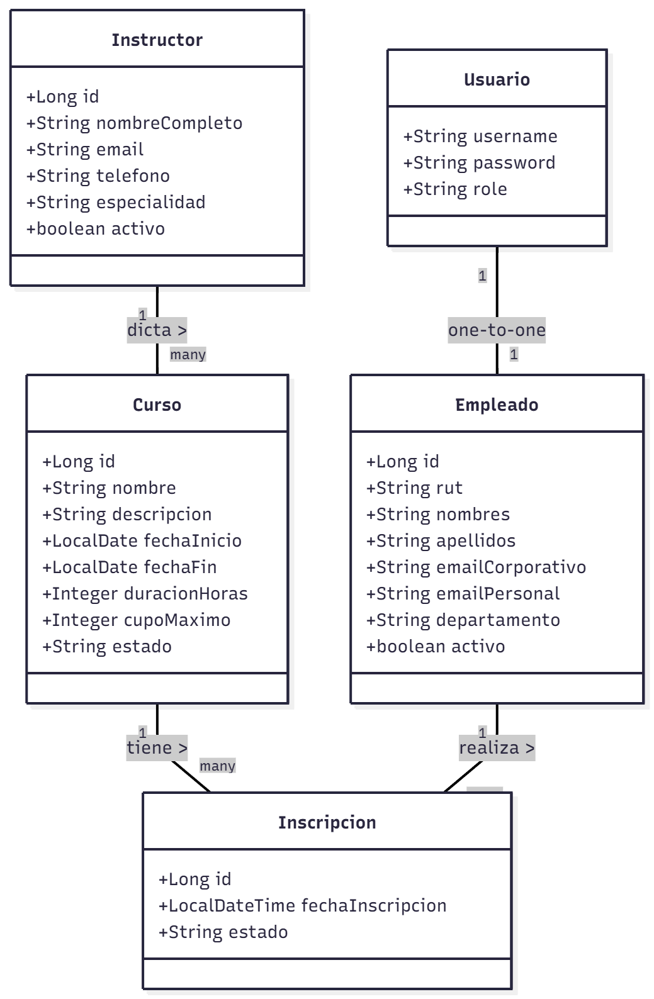
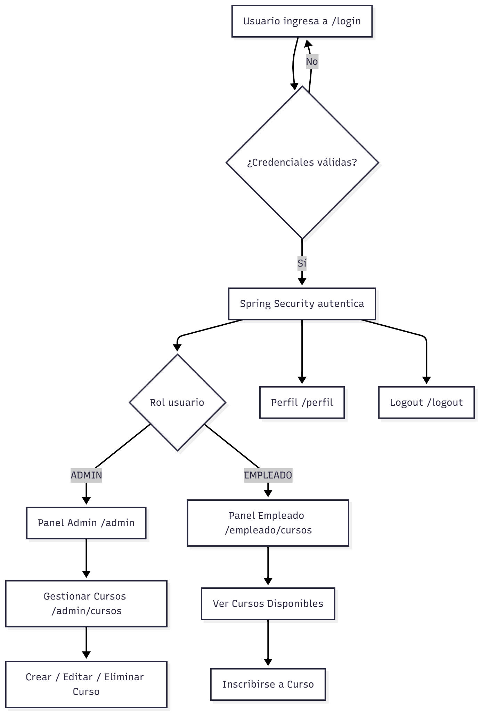
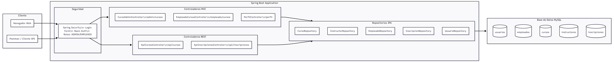
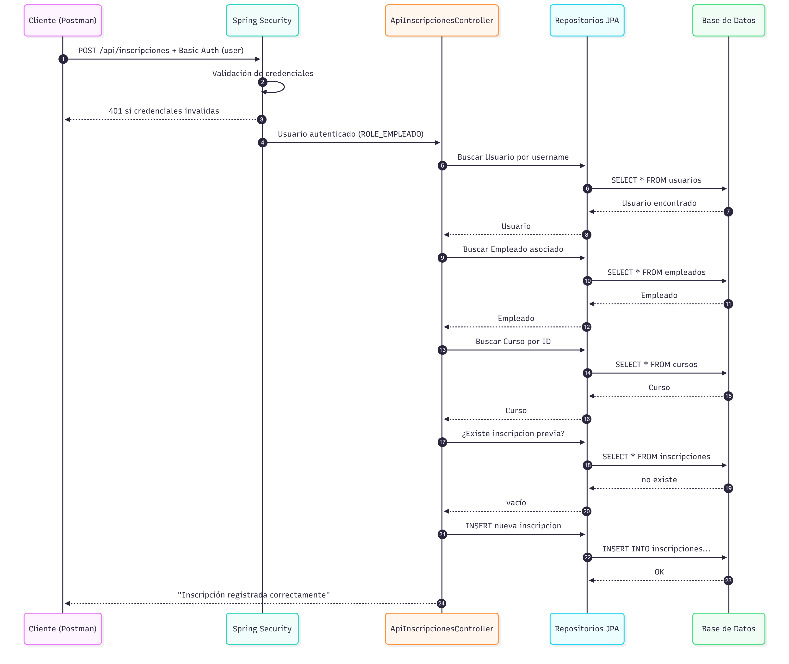

# Sistema de Capacitación Empresarial

> Aplicación web empresarial para la gestión integral de programas de capacitación, desarrollada con **Spring Boot 3** y arquitectura de capas.

[](https://spring.io/projects/spring-boot)
[](https://www.oracle.com/java/)
[](https://www.mysql.com/)
[](LICENSE)

---

## 📋 Tabla de Contenidos

- [Descripción General](#-descripción-general)
- [Características Principales](#-características-principales)
- [Stack Tecnológico](#-stack-tecnológico)
- [Requisitos Previos](#-requisitos-previos)
- [Instalación y Configuración](#-instalación-y-configuración)
- [Roles y Autenticación](#-roles-y-autenticación)
- [Estructura del Proyecto](#-estructura-del-proyecto)
- [API REST](#-api-rest)
- [Navegación Web](#-navegación-web)
- [Diagramas del Sistema](#-diagramas-del-sistema)
- [Pruebas](#-pruebas)
- [Autor](#-autor)

---

## 🎯 Descripción General

Sistema integral de gestión de capacitaciones que permite administrar cursos, instructores, empleados e inscripciones a través de una interfaz web intuitiva y una API REST segura. Implementa autenticación por roles y control de acceso granular mediante Spring Security.

### Funcionalidades Clave

- **Gestión de Cursos**: Creación, edición y seguimiento del estado de programas de capacitación
- **Administración de Instructores**: Base de datos de facilitadores con especialidades
- **Control de Inscripciones**: Proceso automatizado de registro con validación de cupos
- **Panel por Roles**: Interfaces diferenciadas para administradores y empleados
- **API REST Segura**: Endpoints protegidos con autenticación básica

---

## ✨ Características Principales

- ✅ Autenticación y autorización con **Spring Security 6**
- ✅ Arquitectura MVC con separación de responsabilidades
- ✅ Persistencia de datos con **Spring Data JPA**
- ✅ Vistas dinámicas con **Thymeleaf**
- ✅ Diseño responsive con **TailwindCSS**
- ✅ API REST con documentación integrada
- ✅ Validación de datos en múltiples capas
- ✅ Manejo centralizado de excepciones

---

## 🛠 Stack Tecnológico

### Backend
- **Java 17** - Lenguaje de programación
- **Spring Boot 3.5.x** - Framework principal
- **Spring Security 6** - Autenticación y autorización
- **Spring Data JPA** - Capa de persistencia
- **Spring MVC** - Arquitectura web

### Frontend
- **Thymeleaf** - Motor de plantillas
- **TailwindCSS** - Framework CSS (CDN)
- **HTML5 / JavaScript**

### Base de Datos
- **MySQL 8.0** - Sistema de gestión de base de datos

### Seguridad
- **BCrypt** - Encriptación de contraseñas
- **HTTP Basic Authentication** - Seguridad API REST

---

## 📦 Requisitos Previos

Antes de comenzar, asegúrate de tener instalado:

- **JDK 17** o superior
- **Maven 3.8+**
- **MySQL 8.0+**
- **IDE recomendado**: IntelliJ IDEA, Eclipse o VS Code

---

## 🚀 Instalación y Configuración

### 1. Clonar el Repositorio

```bash
git clone https://github.com/tu-usuario/M6_EV_PORTAFOLIO.git
cd M6_EV_PORTAFOLIO
```

### 2. Configurar Base de Datos

#### Crear la base de datos

```sql
CREATE DATABASE sistema_autenticacion
    CHARACTER SET utf8mb4
    COLLATE utf8mb4_unicode_ci;
```

#### Crear tablas principales

```sql
-- Tabla de usuarios
CREATE TABLE usuarios (
    username VARCHAR(50) COLLATE utf8mb4_unicode_ci PRIMARY KEY,
    password VARCHAR(60) COLLATE utf8mb4_unicode_ci NOT NULL,
    role VARCHAR(20) COLLATE utf8mb4_unicode_ci NOT NULL
) ENGINE=InnoDB;

-- Tabla de empleados
CREATE TABLE empleados (
    id BIGINT AUTO_INCREMENT PRIMARY KEY,
    rut VARCHAR(20),
    nombres VARCHAR(100) NOT NULL,
    apellidos VARCHAR(100) NOT NULL,
    email_corporativo VARCHAR(150),
    email_personal VARCHAR(150),
    departamento VARCHAR(100),
    activo TINYINT(1) NOT NULL DEFAULT 1,
    username VARCHAR(50) COLLATE utf8mb4_unicode_ci,
    CONSTRAINT fk_empleados_usuario
        FOREIGN KEY (username)
        REFERENCES usuarios (username)
        ON DELETE SET NULL
        ON UPDATE CASCADE
) ENGINE=InnoDB;

-- Tabla de instructores
CREATE TABLE instructores (
    id BIGINT AUTO_INCREMENT PRIMARY KEY,
    nombre_completo VARCHAR(150),
    email VARCHAR(150),
    telefono VARCHAR(30),
    especialidad VARCHAR(100),
    activo TINYINT(1)
) ENGINE=InnoDB;

-- Tabla de cursos
CREATE TABLE cursos (
    id BIGINT AUTO_INCREMENT PRIMARY KEY,
    nombre VARCHAR(150),
    descripcion TEXT,
    fecha_inicio DATE,
    fecha_fin DATE,
    duracion_horas INT,
    cupo_maximo INT,
    estado VARCHAR(20),
    instructor_id BIGINT,
    FOREIGN KEY (instructor_id) REFERENCES instructores(id)
) ENGINE=InnoDB;

-- Tabla de inscripciones
CREATE TABLE inscripciones (
    id BIGINT AUTO_INCREMENT PRIMARY KEY,
    fecha_inscripcion DATETIME,
    estado VARCHAR(20),
    empleado_id BIGINT,
    curso_id BIGINT,
    FOREIGN KEY (empleado_id) REFERENCES empleados(id),
    FOREIGN KEY (curso_id) REFERENCES cursos(id)
) ENGINE=InnoDB;
```

#### Insertar datos de prueba

```sql
-- Usuarios del sistema (contraseñas encriptadas con BCrypt)
INSERT INTO usuarios VALUES
('admin', '$2a$10$HagaloUstedMismoAdmin', 'ADMIN'),
('user', '$2a$10$ClaveBcryptUser', 'EMPLEADO');

-- Empleado vinculado al usuario
INSERT INTO empleados (rut, nombres, apellidos, email_corporativo, email_personal, departamento, activo, username)
VALUES ('11.111.111-1', 'Matías', 'Rojas', 'matias.rojas@empresa.cl', 'matias@gmail.com', 'TI', 1, 'user');

-- Instructores
INSERT INTO instructores (nombre_completo, email, telefono, especialidad, activo)
VALUES
('Ana Pérez', 'ana.perez@empresa.cl', '987654321', 'Java Backend', 1),
('Carlos Soto', 'carlos.soto@empresa.cl', '912345678', 'Seguridad Informática', 1);

-- Cursos de ejemplo
INSERT INTO cursos (nombre, descripcion, fecha_inicio, fecha_fin, duracion_horas, cupo_maximo, estado, instructor_id)
VALUES
('Introducción a Spring Boot',
 'Curso básico de Spring Boot para construir APIs y aplicaciones web.',
 '2025-11-20', '2025-11-22', 12, 30, 'PROGRAMADO', 1),
('Fundamentos de Seguridad con Spring Security',
 'Buenas prácticas de autenticación y autorización.',
 '2025-11-25', '2025-11-27', 8, 25, 'PROGRAMADO', 2);
```

### 3. Configurar `application.properties`

```properties
# Configuración de Base de Datos
spring.datasource.url=jdbc:mysql://localhost:3306/sistema_autenticacion?useSSL=false&serverTimezone=UTC
spring.datasource.username=tu_usuario
spring.datasource.password=tu_contraseña

# Configuración JPA
spring.jpa.hibernate.ddl-auto=none
spring.jpa.show-sql=true
spring.jpa.properties.hibernate.format_sql=true

# Puerto del servidor
server.port=8080
```

### 4. Ejecutar la Aplicación

#### Con Maven

```bash
mvn clean install
mvn spring-boot:run
```

#### Desde IDE

Ejecuta la clase principal `Application.java` como aplicación Java.

### 5. Acceder al Sistema

Abre tu navegador en: `http://localhost:8080`

---

## 🔐 Roles y Autenticación

### Credenciales de Prueba

| Rol | Usuario | Contraseña | Permisos |
|-----|---------|------------|----------|
| **ADMIN** | `admin` | `Admin123!` | Gestión completa del sistema |
| **EMPLEADO** | `user` | `User123!` | Visualización e inscripción a cursos |

> ⚠️ **Importante**: Cambia las contraseñas predeterminadas en un entorno de producción.

### Permisos por Rol

#### Administrador (ADMIN)
- ✅ CRUD de cursos
- ✅ CRUD de instructores
- ✅ Gestión de empleados
- ✅ Reportes y estadísticas

#### Empleado (EMPLEADO)
- ✅ Visualizar cursos disponibles
- ✅ Inscribirse a cursos
- ✅ Ver mis inscripciones
- ✅ Editar perfil personal

---

## 📁 Estructura del Proyecto

```
M6_EV_PORTAFOLIO/
├── src/
│   ├── main/
│   │   ├── java/
│   │   │   └── com/empresa/capacitacion/
│   │   │       ├── config/          # Configuración de Spring Security
│   │   │       ├── controller/      # Controladores MVC y REST
│   │   │       ├── model/           # Entidades JPA
│   │   │       ├── repository/      # Repositorios Spring Data
│   │   │       ├── service/         # Lógica de negocio
│   │   │       └── dto/             # Data Transfer Objects
│   │   └── resources/
│   │       ├── templates/           # Vistas Thymeleaf
│   │       ├── static/              # Recursos estáticos
│   │       └── application.properties
│   └── test/                        # Tests unitarios e integración
├── docs/                            # Documentación y diagramas
├── pom.xml
└── README.md
```

---

## 🌐 API REST

### Endpoints Disponibles

#### Cursos

**Listar todos los cursos**
```http
GET /api/cursos
Authorization: Basic {credentials}
```

**Respuesta**
```json
[
  {
    "id": 1,
    "nombre": "Introducción a Spring Boot",
    "descripcion": "Curso básico...",
    "fechaInicio": "2025-11-20",
    "fechaFin": "2025-11-22",
    "duracionHoras": 12,
    "cupoMaximo": 30,
    "estado": "PROGRAMADO",
    "instructor": {
      "id": 1,
      "nombreCompleto": "Ana Pérez",
      "especialidad": "Java Backend"
    }
  }
]
```

#### Inscripciones

**Inscribir empleado a curso**
```http
POST /api/inscripciones
Authorization: Basic {credentials-empleado}
Content-Type: application/json

{
  "cursoId": 1
}
```

**Respuestas Posibles**

| Código | Descripción |
|--------|-------------|
| 201 | Inscripción exitosa |
| 400 | Empleado ya inscrito en el curso |
| 403 | Solo empleados pueden inscribirse |
| 404 | Curso no encontrado |

---

## 🧭 Navegación Web

### Rutas Principales

| Ruta | Descripción | Acceso |
|------|-------------|--------|
| `/login` | Página de inicio de sesión | Público |
| `/panel` | Panel principal (redirige según rol) | Autenticado |
| `/admin/cursos` | Gestión de cursos | ADMIN |
| `/admin/instructores` | Gestión de instructores | ADMIN |
| `/empleado/cursos` | Catálogo de cursos disponibles | EMPLEADO |
| `/empleado/inscripciones` | Mis inscripciones | EMPLEADO |
| `/perfil` | Datos del usuario | Autenticado |
| `/logout` | Cerrar sesión | Autenticado |

---

## 📊 Diagramas del Sistema

### Diagrama de Clases


### Diagrama de Navegación


### Diagrama de Arquitectura


### Diagrama de Secuencia


---

## 🧪 Pruebas

### Pruebas con Postman

1. **Importar la colección** ubicada en `/docs/postman/`
2. **Configurar las variables de entorno**:
   - `base_url`: `http://localhost:8080`
   - `admin_username`: `admin`
   - `admin_password`: `Admin123!`
   - `empleado_username`: `user`
   - `empleado_password`: `User123!`

3. **Ejecutar las pruebas** en el orden sugerido:
   - ✅ Login Admin
   - ✅ Listar Cursos
   - ✅ Crear Curso
   - ✅ Login Empleado
   - ✅ Inscribirse a Curso

### Pruebas Unitarias

```bash
mvn test
```

---

## 📝 Licencia

Este proyecto está licenciado bajo la Licencia MIT. Consulta el archivo [LICENSE](LICENSE) para más detalles.

---

## 👤 Autor

**Manuel Ibarra**  
Bootcamp Java - Proyecto Evaluativo Módulo 6
